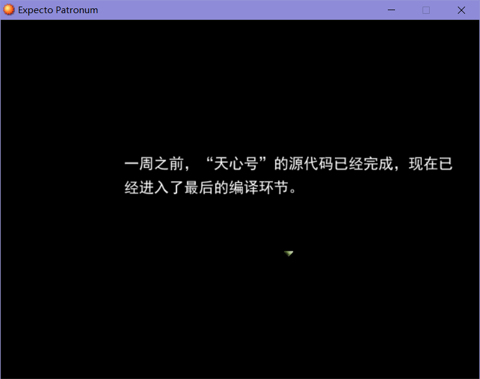
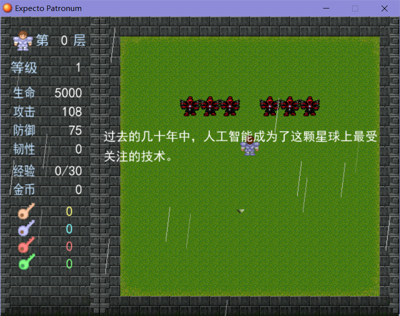
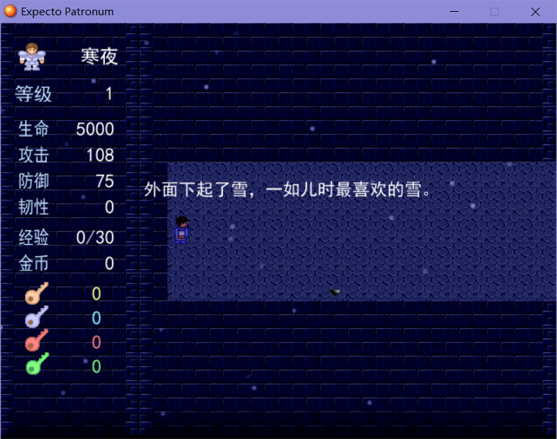
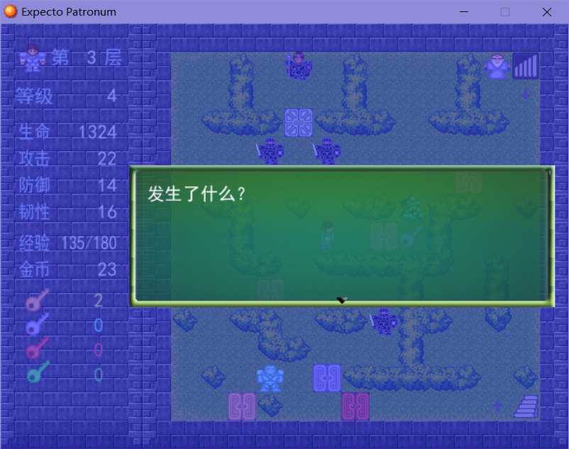
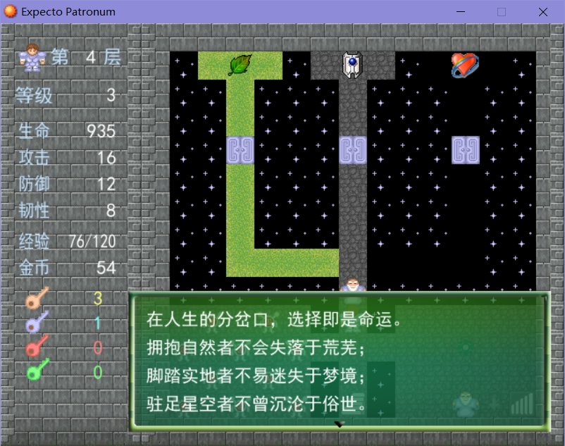
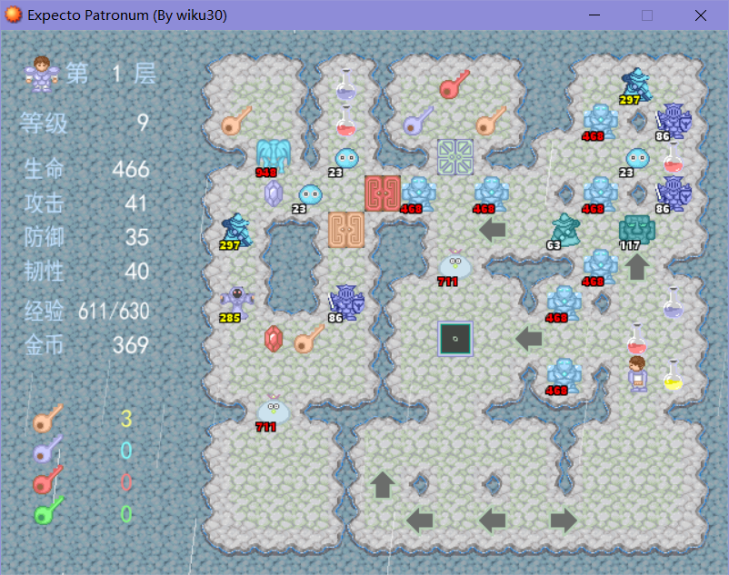
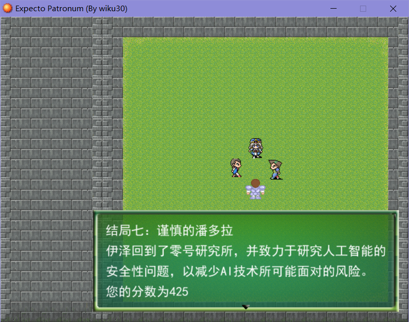
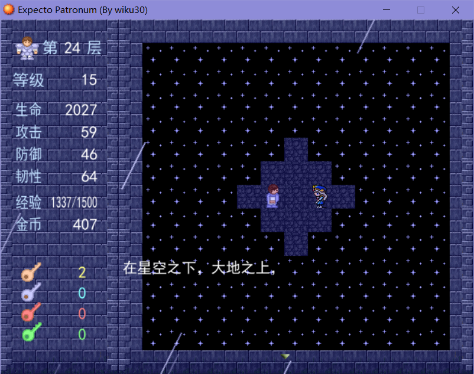

# 魔塔：Expecto Patronum

作者：wiku30

平台：windows

使用工具：RMXP + 魔塔样板7630

最新稳定版本：Ver 2.2

发布日期：20.06.25

## 故事背景

21世纪中叶，人工智能技术的发展空前迅猛。在“零号研究所”研发的“天心号”强人工智能机器人即将问世之际，科学家伊泽出于对人工智能统治人类之可能性的担忧，于最后关头破坏了该计划。在那个全民都对人工智能无比狂热的时代，伊泽不仅被研究所开除，亦被民众所谴责和唾弃。

在命运的寒冬里，伊泽无意识地在漫步于滴水成冰的寒夜中。当其在寒冷中近乎失去知觉之时，身上一个古老的、来自某个熟悉面孔的守护咒文使恢复了生命力，但他却无法回忆起曾发生过的一切。在守护咒的作用下，所有遗失的事物都不会真正消失，只是被封印在平行世界的一座梦境之塔里。当一切都回到起点之时，他获得了一次改写往日遗憾的机会。然而，在危机四伏的平行世界里，命运又何去何从？

## 基本游戏机制：

***金币/经验机制***

基本与传统魔塔相似，不同之处：

金币商店每次可购买80(每次+40)生命/1攻击/1防御，第一次购买需要30金币，之后每次上涨35%。

无经验商店，但经验达到升级要求时自动升级。第一次升级需要30经验，之后每次比前一次多需要10经验。升级后经验不消耗，这使得「沉沦」技能（战斗前丢失7%经验）在游戏后期极为致命。每次升级获得100(+25\*新等级)生命、1攻击和1防御。自6级起，升级增加生命值变为4倍（400+100\*等级）。

除「灵魂之石」外，所有怪物的经验值为其金币值的平方根（向下取整），这使得后期经验增长幅度低于金币。

此外，触发*某剧情*后，商店价格会降低至50（每次增长15%，次数不刷新）。

***核心机制：灵魂之石***

「灵魂之石」是该游戏的核心目标物之一，为主角的记忆碎片，需要通过击败来收集。每颗灵魂之石能使主角获得大量经验值与8%伤害减免，这使其拥有重要的战略作用。然而其生命随主角经验积累而降低和攻击力叠加的机制，使其收集时机较为重要。

***特殊宝物机制：护符***

4楼的三个护符可以让主角对荒芜、梦幻、沉沦这三种较为棘手的怪物技能获得抵抗力，但持有多个护符会有额外的代价：取得第一个护符只需1把蓝钥匙，但第二个需要3蓝，第三个需要4蓝+1红。因此护符的选择将产生如新新魔塔中章一样的分支，但具有更多创造性。

## 版本更新/BUG修复/时间线

##### (Ver 2.2, Release, 20.06.25)

- 修复了剩余的bug
- 增加了隐藏结局后的彩蛋

##### (Beta 1.01, 20.06.02)

- 修复了部分视觉上的bug

##### (Beta 1.0, 20.06.02)

- Beta版完成
- TODO：剧情优化 & 成就系统

##### (Ver 2.12, 20.05.19)

- 隐藏剧情动画制作完成

##### (Ver 2.11, 20.05.19)

- 增加了一些隐藏剧情
- 修正了“银月守卫”属性被错误提升的bug。现在属性被提升的为“高级银月守卫”
- 增加了13楼“机器之心”
- 结局1~7完成

##### (Ver 2.1, 20.05.02)

- 增加了第6颗魂石的剧情
- 部分技能的介绍中将详细指出相应数值
- 修正了部分bug
- 现在9F机关只要通过一次即不会再触发
- 商店加血由125调整至80（+40*已购买次数），允许了特殊情况下买血救急的可能性。

##### (Ver 2.02, 19.12.19)

* 修正了荒芜怪的伤害范围，现在十字领域包括与之重叠的方格（以使隐形怪更加合理）
* 相应回调了10F boss属性（HP 540 -> 525），现可15血打过10F boss

##### (Ver 2.01, 19.12.12)

* 新路线测试成功，5F生命值9 -> 25
* 10F boss属性略微增加（HP 525 -> 540），可35血通关（档48），共优化72血

##### 10层测试版（Ver 2.0, 19.12.12）

* 修正了商店扣钱数有时比显示价格多1金币的bug。
  该bug来自于早期版本中实际金币数/价格为浮点数而游戏中仅显示整数部分。现在商店价格向下取整，因而实际扣钱总与显示值相同。
* 略微增加了5层boss的属性，这使得某条高级路线需要更加严格的优化，而常规路线通过5层boss的难度依然很低。
* 增加了伤害显示脚本。

##### 5层测试版（Ver 1.0, 19.11.09）

* 第一测试版发布。

##### 第一张地图（18.07.01）

* 初步确立了游戏机制与背景设定。